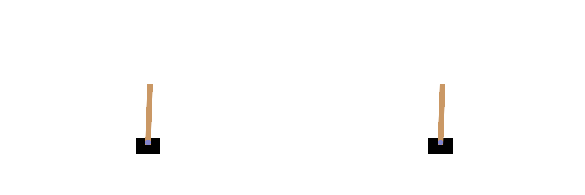

# RL Fundamentals: DQN and PPO from Scratch

Implementations of two core reinforcement learning algorithms built from scratch
in PyTorch, benchmarked on `CartPole-v1`. Learning-stage groundwork for an
autonomous-decision-making portfolio.

## Results

| Agent            | Avg. Episode Reward | Notes                          |
|------------------|---------------------|--------------------------------|
| Random baseline  | ~21                 | No learning                    |
| DQN              | ~100-250            | Learns, but training unstable  |
| PPO              | 500 (max)           | Solves the environment, stable |

*Left: DQN &nbsp;|&nbsp; Right: PPO*

## Key Takeaway

DQN exhibits the characteristic collapse-recovery instability of value-based
methods (Q-value overestimation). PPO's clipped surrogate objective constrains
per-update policy change, producing smooth and stable convergence - the reason
PPO is preferred where training stability matters (e.g. autonomous systems).

## Implemented Components

**DQN:** Q-network, replay buffer, epsilon-greedy exploration, target network,
Bellman loss.

**PPO:** Actor-Critic network, on-policy rollout collection, Generalized
Advantage Estimation (GAE), clipped surrogate objective, entropy bonus.

## Stack

Python, PyTorch, Gymnasium.
